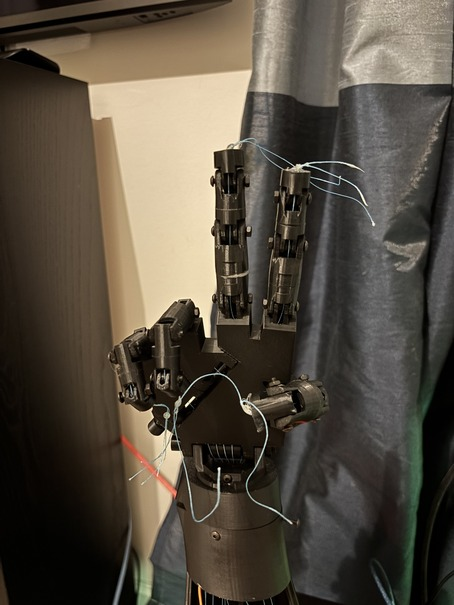

# Vision-Controlled-Prosthetic-Hand
A low-cost prosthetic hand that utilizes camera-based hand recognition and Arduino to mimic hand movement in real time.

# Overview
This project explores a low-cost approach to traditional prosthetics by using a standard webcam and 3D-printed parts. With OpenCV and MediaPipe, this prosthetic leverages computer vision to track hand landmarks in realtime and translates gestures to actuate servo motors that control each finger. This approach eliminates the need for flex sensors or wearable gloves, providing a more cost-effective solution to gesture recognition. 
